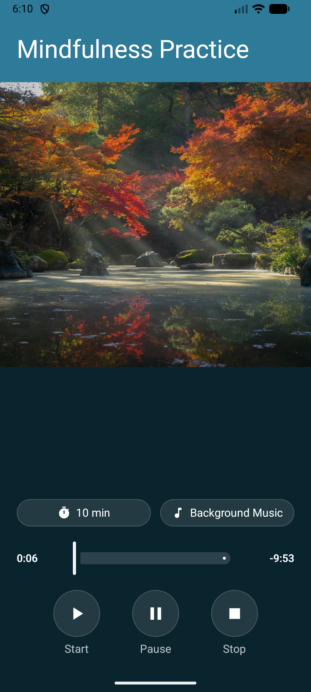
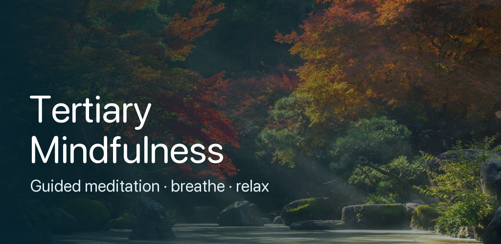

# Mindfulness (Android)

A native **Android** app for practicing mindfulness — a **"Mindfulness Practice"** session with a
calm, soothing female voice guiding your breath, playing locally on your phone. Choose your
**session length**, optionally add **background music from your own device**, and use simple
Start / Pause / Stop controls with a scrubber. No account, no network, no data collection.

This is a faithful native Android port of the iOS app
[alfredang/mindfulnessapp](https://github.com/alfredang/mindfulnessapp) — same single screen,
same guided narration, same dark-teal look.


> **Status:** submitted to the Google Play Console as **Tertiary Mindfulness**
> (`com.alfredang.mindfulnesspractice`) — currently **in review** on the closed-testing track.



## Tech Stack

-3DDC84?logo=android&logoColor=white)


- **Kotlin / Jetpack Compose** — single-screen declarative UI (Material 3)
- **MediaPlayer** — one player for the bundled guided voice, plus a looping background-music player
- **Storage Access Framework** — `ACTION_OPEN_DOCUMENT` to pick background music from the device
- **AndroidViewModel** — wall-clock session timer with auto-stop at the chosen length
- **Gradle (AGP 8.7)** — signed App Bundle (`.aab`) build for the Play Store

## Features

- 🧘 Guided **Mindfulness Practice** meditation with a soothing female voice
- ⏱️ **Adjustable session length** — 5 / 10 / 15 / 20 minutes
- 🎵 **Background music** — play an audio file from your device, gently under the voice
- ▶️ **Start / Pause / Stop** transport with a draggable progress scrubber
- 📱 **Phone**, portrait, fully offline — nothing leaves the device

## Architecture

The app is four Kotlin files under [`app/src/main/java/com/alfredang/mindfulnesspractice/`](app/src/main/java/com/alfredang/mindfulnesspractice/):

| File | Role |
|------|------|
| `MainActivity.kt` | `ComponentActivity` entry; edge-to-edge `setContent { PracticeScreen() }` |
| `PracticeScreen.kt` | The full Compose UI — title, zen image, length + music pills, scrubber, transport |
| `PracticeViewModel.kt` | `AndroidViewModel` — voice `MediaPlayer` + looping music player; wall-clock session timer with auto-stop at the chosen length |
| `Theme.kt` | Central color palette (dark teal) |

`PracticeScreen` mirrors the player's `currentTime` into a local scrub value, gated by an
`isScrubbing` flag so dragging the slider doesn't fight live playback updates. All visual styling
flows from `Theme`. This mirrors the iOS app's `PracticeView` / `PracticePlayerViewModel` split
one-to-one.

> **Audio:** the guided narration (`app/src/main/res/raw/mindfulness_practice.m4a`, ~1.3 MB) is the
> same track as the iOS app — generated from [`transcript.txt`](app/src/main/res/raw/transcript.txt)
> with the neural on-device TTS [kyutai `pocket-tts`](https://github.com/kyutai-labs/pocket-tts)
> (female voice "anna"), slowed + warmed + softened in ffmpeg for a calm, unhurried delivery.

## Build & Run

Requires the Android SDK and a JDK 17+ (Android Studio's bundled JBR works). The SDK path is read
from `local.properties` (gitignored).

```bash
./gradlew :app:assembleDebug                  # debug APK → app/build/outputs/apk/debug/
./gradlew :app:bundleRelease                  # signed release AAB → app/build/outputs/bundle/release/

# install + run on a connected device / emulator
adb install -r app/build/outputs/apk/debug/app-debug.apk
adb shell am start -n com.alfredang.mindfulnesspractice/.MainActivity
```

## Release signing & Play Store

Release builds are signed with an **upload keystore**. Signing is wired through a gitignored
`keystore.properties` at the repo root (see [`keystore.properties.example`](keystore.properties.example)):

```properties
storeFile=../upload-keystore.jks
storePassword=********
keyAlias=upload
keyPassword=********
```

Build the bundle and upload `app/build/outputs/bundle/release/app-release.aab` to the
**Google Play Console**. Enrol the app in **Play App Signing** so Google manages the final
app-signing key; you keep the upload key. See [`PLAY_STORE.md`](PLAY_STORE.md) for the full
step-by-step submission checklist.

The store-listing assets used for the submission are committed at the repo root:
`playstore-icon-512.png` (icon), `feature-graphic.png` (1024×500 feature graphic), and
`store_shot_1.png` / `store_shot_2.png` (9:16 phone screenshots).



## Acknowledgements

Built by [Tertiary Infotech Academy Pte Ltd](https://www.tertiaryinfotech.com/).
Native Android port of the iOS [Mindfulness](https://github.com/alfredang/mindfulnessapp) app.
